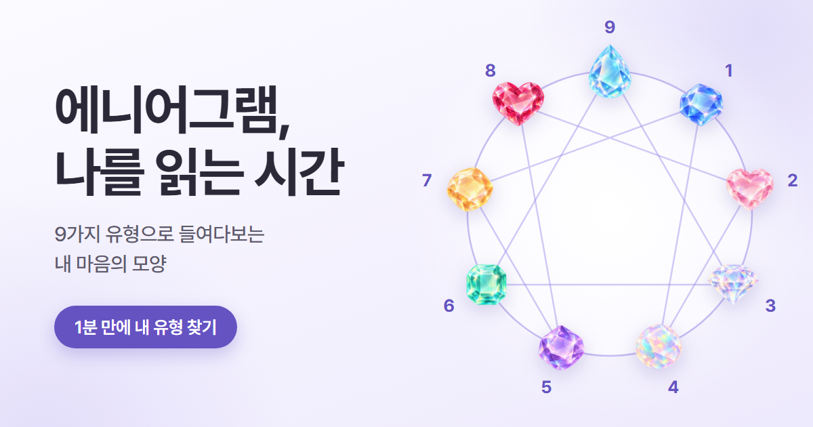
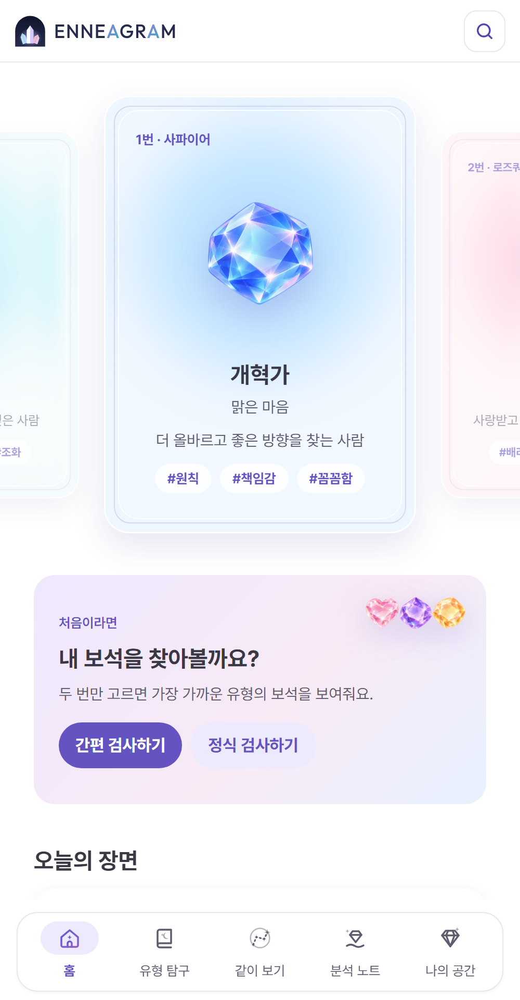
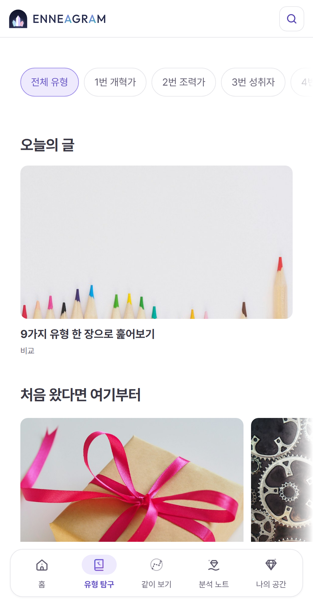
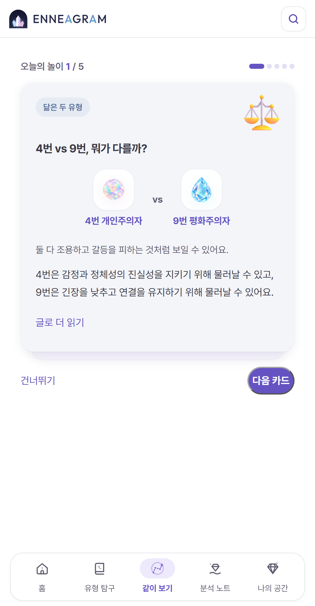
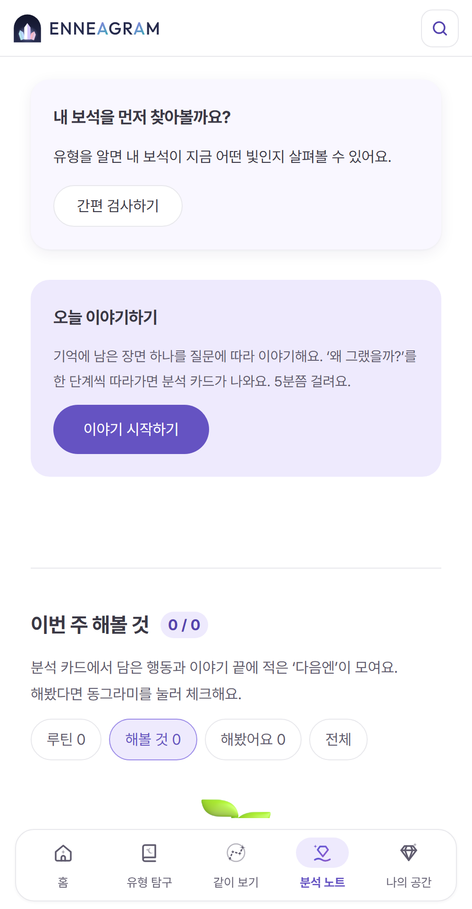
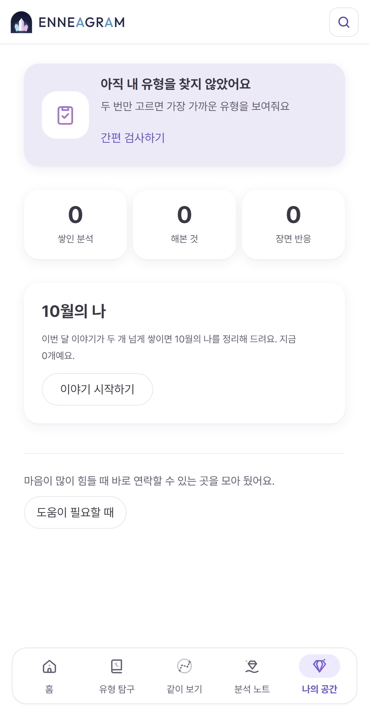

<p align="center">
  
</p>

<h1 align="center">에니어그램 · 나를 읽는 시간</h1>

<p align="center">
  9가지 유형을 보석으로 만나고, 오늘의 장면을 이야기하며 반복되는 내 패턴을 알아차리는 모바일 웹 서비스
  <br><br>
  <a href="https://hongchopper.github.io/enneagram/"><b>사이트 바로 가기 →</b></a>
</p>

---

## 어떤 서비스인가요

에니어그램 검사는 많지만 대부분 결과를 한 번 보고 끝나요. 이 서비스는 **유형을 맞히는 데서 끝내지 않고**, 일상의 장면을 쌓아 가며 *"아, 이게 내 패턴이구나"* 를 알아차리도록 돕습니다.

- **유형** — 9가지 유형을 보석(사파이어 ~ 아쿠아마린)으로 소개하고, 간편 · 정식 검사로 가까운 유형을 찾아요.
- **기록** — 오늘 있었던 장면을 질문에 따라 이야기하면 연마 처방전이 나오고, 쌓인 분석에서 반복되는 흐름이 보여요.
- **관계** — 같은 장면, 같은 질문에서 서로 다르게 반응하는 모습을 친구와 나란히 봐요. 궁합이나 점수는 없어요.

> 유형은 진단이 아니라 나를 관찰하는 틀이에요. 결과는 '확정'이 아니라 '가까운 후보'로 보여줍니다.

## 화면

<table>
  <tr>
    <td align="center"><br><b>홈</b><br><sub>9가지 유형 카드 · 검사 · 오늘 할 것</sub></td>
    <td align="center"><br><b>유형 탐구</b><br><sub>주제별 글, 열 때마다 섞여요</sub></td>
    <td align="center"><br><b>같이 보기</b><br><sub>한 장씩 넘기는 오늘의 놀이 5장</sub></td>
    <td align="center"><br><b>분석 노트</b><br><sub>보석 상태 · 이야기하기 · 해볼 것</sub></td>
    <td align="center"><br><b>나의 공간</b><br><sub>내 유형 · 숫자 · 상태 변화 · 리포트</sub></td>
  </tr>
</table>

## 하단 탭과 역할

| 탭 | 답하는 질문 | 주요 기능 |
|---|---|---|
| **홈** | 지금 뭘 하면 좋을까? | 9가지 유형 카드, 검사 배너, 오늘(보석 상태 · 이야기하기 · 해볼 것), 오늘의 장면, 오늘 읽을 글 |
| **유형 탐구** | 에니어그램과 9가지 유형은 어떤 걸까? | 주제별 글 줄(오늘의 글 · 헷갈릴 때 · 닮은 두 유형 …), 유형 요약 · 기초 · 비교 |
| **같이 보기** | 관계 속에서 나는 어떻게 반응할까? | 나라면? · 몇 번일까? · 닮은 두 유형 · 둘이서 질문 · 말 연습 · 오늘 물어볼 말 |
| **분석 노트** | 오늘 무슨 일이 있었고, 뭘 해볼까? | 보석 상태(20문항) → 오늘 이야기하기(채팅) → 이번 주 해볼 것 → 쌓인 분석 |
| **나의 공간** | 나는 어떤 사람이고, 무엇이 쌓였을까? | 내 유형 한 줄, 숫자 세 칸, 보석 상태 변화, ○월의 나, 도움이 필요할 때 |

자세한 메뉴 구조와 새 기능을 둘 자리는 [`docs/정보구조_IA.md`](docs/정보구조_IA.md)에 있어요.

## 만든 방식

- **정적 사이트** — 서버 없이 HTML · CSS · JavaScript만으로 동작하고 GitHub Pages로 배포해요. `main`에 푸시하면 몇 분 안에 반영됩니다.
- **기록은 내 기기에만** — 검사 결과 · 이야기 · 해볼 것은 브라우저 `localStorage`에 저장돼요. 형식을 바꿀 때는 `schemaVersion`과 옮기기(migration)를 함께 만듭니다.
- **링크로 나누기** — 친구와 비교 · 질문 카드는 주소(`#share=` · `#pair=` · `#scene=`)에 필요한 값만 담아 보내요. 기록은 공유하지 않아요.
- **모바일 웹 기준** — 어떤 화면에서도 앱 폭(616px) 열 안에 그려요. 색 · 글자 크기 · 반경은 [`css/tokens.css`](css/tokens.css)의 토큰만 씁니다.

## 실행

```bash
node tools/dev-server.js --open
```

Windows에서는 `start-server.bat`을 더블클릭해도 돼요. http://localhost:5500 이 열리고, 파일을 저장하면 자동으로 새로고침됩니다 (CSS는 새로고침 없이 바로 바뀌어요).

## 폴더

```text
index.html               마크업 (화면 = page-panel)
css/tokens.css           디자인 토큰 — 값의 유일한 출처
css/layers/NN-*.css      스타일 레이어 (번호 순서대로 읽힘)
js/NN-*.js               기능 스크립트 (00 메뉴·홈 · 02 분석 노트·나의 공간 · 10 유형 탐구 · 11 장면 게임 · 12 같이 보기)
content/                 유형 핸드북 · 글 · 관계 카드 데이터
assets/                  보석 · 입체 이모지 · 사진 · 로고
docs/                    가이드 · 요구사항 · 정보 구조
tools/                   개발 서버 · 캐시 버전 · 화면 검사
```

## 작업 규칙과 문서

작업 규칙은 [`CLAUDE.md`](CLAUDE.md)에 모여 있어요. 주요 문서:

- [`docs/정보구조_IA.md`](docs/정보구조_IA.md) — 하단 탭 역할 · 배치 규칙
- [`docs/UI_안티슬롭_가이드.md`](docs/UI_안티슬롭_가이드.md) — 화면 · 컴포넌트 규칙과 점검표
- [`docs/UX_라이팅_가이드.md`](docs/UX_라이팅_가이드.md) — 말투 · 용어 · 유형 이름 표준
- [`docs/리서치_사용자와_질문.md`](docs/리서치_사용자와_질문.md) — 사용자 · 질문 · 민감한 상황 원칙
- [`docs/prd-v2.md`](docs/prd-v2.md) — 제품 요구사항

커밋할 때 `.githooks/pre-commit`이 CSS · JS 주소에 내용 해시 버전(`?v=`)을 붙여요. 새로 clone했다면 한 번 `git config core.hooksPath .githooks`를 실행하세요.

## 출처

- 입체 이모지: [Fluent Emoji](https://github.com/microsoft/fluentui-emoji) (MIT) — [`assets/illust/LICENSE-fluentui-emoji.txt`](assets/illust/LICENSE-fluentui-emoji.txt)
- 사진: Unsplash — [`assets/photos/CREDITS.md`](assets/photos/CREDITS.md)
